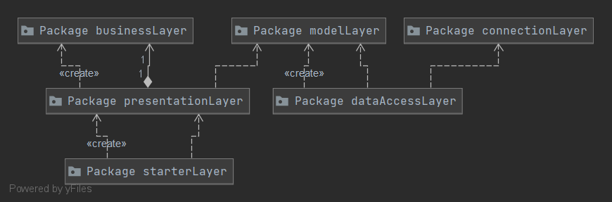

# Analysis and Design Document

# Requirement analysis

## Assignment Specification
Application description
Use JAVA/C# API to design and implement an application for the front desk employees of a bank. The application should have two types of users (a regular user represented by the front desk employee and an administrator user) which have to provide a username and a password in order to use the application.

## Function requirements
The regular user can perform the following operations:  
	-Add/update/view client information (name, identity card number, personal numerical code, address, etc.).  
	-Create/update/delete/view client account (account information: identification number, type, amount of money, date of creation).  
	-money between accounts.  
	-Process utilities bills (represented as money transfer to some predefined accounts of utility companies - e.g., gas, electricity, internet).  

The administrator user can perform the following operations:  
	-CRUD on employees’ information.  

## Non-functional Requirements
1)Availability describes how likely the system is accessible for a user at a given point in time.Our system is available 24/7 with a monthly maintenance which will take place on the first day of the month and will take about 4 hours.  
2)Usability - the application is accesed via a graphical user interface very simple and easy to use  
3)Security - security of the confidential data from users is very important for an application and for that reason all employees will choose a before inserted in the database.  
4)Testability - all the updates made for the application are tested ,so for every users input it will be an out which consist of either the information requested or an error which will indicate if the user has done something wrong.  
5)Performance - The system shall provide access to the information requested with no more than 10 second latency. The system will complete all the transactions within 1 minute.  

# Use-Case Model

## Use case 1

    * Use case: Insert employee
    * Level: one of: User goal
    * Primary actor: Administrator 
    * Main success scenario: First the administrator login then the empty fields name, username, password, email are fill in and then press the "Create" button.
    * Extensions: If one of the fields was not properly filled in there will be a message which will suggest what you did wrong (Ex:"Invalid email!").

## Use case 2

    * Use case: View accounts
    * Level: one of: User goal
    * Primary actor: Employee
    * Main success scenario: First the employee login then he click on table on the client for who you want to see their information. 
    * Extensions:-

## Use case 3

    * Use case: Employee
    * Level: one of: User goal
    * Primary actor: Employee
    * Main success scenario: First the employee login then he click on table on the client for who you want to make a transfer and then a new window will appear then will be selected the account from which the transfer will be make and the account where the transfer will go , after that insert the sum and press the "Confirm" button. 
    * Extensions: If the sum inserted is not a number or a negative number there will be a message which will suggest what you did wrong ("Invalid sum!").

# System Architectural Design

## Architectural Pattern Description
I implemented the application with layer pattern architecture wich consist of four layers: Presentation Layer, Business Layer, Persistence Layer, DataBase Layer.
The presentation layer contains all the classes related to the graphical user interface.
The business layer it contains the logic of the application, validators, error messages.
The persistence layer it contains the classes which refer to the data access object which interact directly with the data base.
The data base layer this is where all the data are stored.

## Diagrams

# UML Sequence Diagrams

# Class Design

## Design Patterns Description
Table Data Gateway holds all SQL statements for accessing a single table or view: selects, inserts, updates, and deletes. Other code calls its methods for all interaction with the database.The idea of a table gateway is to provide a gateway class for each database table.

## UML Class Diagram

# Data Model
The data model is represented by Java classes and as database tabels.These classes are stored in the modelLayer of the application.
Database tabels:

